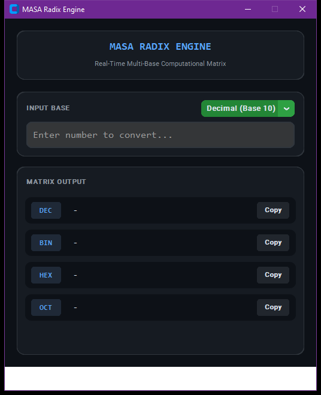

# MASA Radix Engine

A multi-base numeral conversion matrix capable of processing and converting between Decimal, Binary, Hexadecimal, and Octal formats in real time.

## Technical Architecture

The codebase follows modular software engineering patterns and OOP structure, designed for reliability, high maintainability, and clean separation of concerns:

- **Component Layering**: User interface and computational state are decoupled into specialized controllers and event loops.
- **Defensive Engineering**: Comprehensive validation guards protect against malformed inputs and runtime exceptions.
- **Modern Design Tokens**: Designed with a high-contrast dark aesthetic adhering to modern developer tooling visual standards.


## Preview


## Features

- Real-time event-driven conversion via input key-release hooks.
- Dynamic base selection for input data stream parsing.
- Integrated clipboard buffer integration for quick output extraction.
- Defensive exception handling for invalid numerical syntax.

## Prerequisites

- Python 3.10 or higher
- Required packages:

```bash
pip install customtkinter
```

## Execution

Initialize and run the module via the command line:

```bash
python "Number System Conversion App Using Tkinter in Python/main.py"
```

## Project Structure

```
.
├── Number System Conversion App Using Tkinter in Python
├── LICENSE             # MIT License
└── README.md           # Developer documentation
```

## License

This project is licensed under the terms of the MIT License. Refer to the `LICENSE` file for details.

